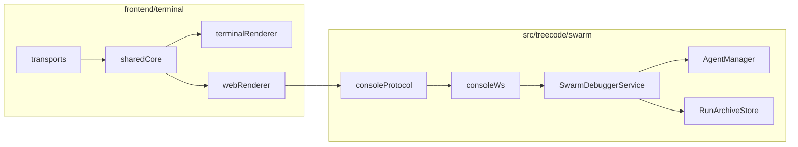

# Multi-Agent Web Console

TreeCode 现在提供一个面向多智能体运行时的 Web 控制台，用于观察、控制、编辑、归档和比较多 agent 树状执行。

> 对应源码：`frontend/terminal/` + `src/treecode/swarm/console_*.py` + `src/treecode/swarm/debugger.py`

---

## 目标

这个控制台不是简单把已有终端 UI 搬到浏览器里，而是把多智能体运行时变成一个可操作的系统：

- 观察 agent 树、消息图、运行指标、审批队列
- 直接从前端创建 agent、暂停/恢复/停止 agent
- 修改上下文、调整拓扑、触发固定场景
- 对多次运行做归档和比较

---

## 整体架构



---

## 前端结构

Web console 复用 `frontend/terminal` 目录，但不是让 Ink 和 DOM 共用一套渲染组件，而是拆成 shared core 和两个 renderer：

### Shared Core

- `frontend/terminal/src/shared/replSession.ts`
  - 单会话 REPL/TUI 的共享 reducer
- `frontend/terminal/src/shared/swarmConsoleState.ts`
  - 多 agent console 的共享状态
- `frontend/terminal/src/shared/swarmConsoleProtocol.ts`
  - 前端命令与服务端消息类型

### Terminal Renderer

- `frontend/terminal/src/terminal/TerminalApp.tsx`
  - 作为 Ink 入口壳层
- `frontend/terminal/src/hooks/useBackendSession.ts`
  - 基于 shared reducer 的 terminal transport

### Web Renderer

- `frontend/terminal/src/web/WebApp.tsx`
- `frontend/terminal/src/web/WebConsoleView.tsx`
- `frontend/terminal/src/web/useSwarmConsole.ts`

### Transports

- `frontend/terminal/src/transports/webSocketClient.ts`
  - 浏览器侧 WebSocket client

---

## 后端结构

### WebSocket 协议与服务

- `src/treecode/swarm/console_protocol.py`
  - 控制台 WS 消息模型
- `src/treecode/swarm/console_ws.py`
  - WebSocket server

### 控制台域服务

- `src/treecode/swarm/debugger.py`
  - 控制台后端主入口，负责：
    - snapshot / playback
    - agent control
    - approval resolve
    - context patch
    - scenario run
    - archive / compare
    - unified `agent_action`

### 固定场景与树管理

- `src/treecode/swarm/manager.py`
  - 不依赖模型行为的 deterministic 场景和 synthetic tree 操作

### 运行归档

- `src/treecode/swarm/run_archive.py`
  - run 级归档、列出历史 run、比较两次 run

---

## 统一 Agent 操作模型

Web console 不再只依赖一堆分散命令，而是通过统一的 `agent_action` 机制驱动任意 agent：

当前已支持：

- `inspect`
- `send_message`
- `spawn_child`
- `pause`
- `resume`
- `stop`
- `reparent`
- `remove`
- `patch_context`
- `run_tool`

其中 `run_tool` 允许控制台代表某个 agent 执行一次真实工具调用，目前优先覆盖无副作用或低副作用工具。

---

## 固定场景

当前内置 deterministic 场景：

| 场景 | 说明 |
|------|------|
| `single_child` | `main -> sub1` |
| `two_level_fanout` | `main -> sub1 -> (A, B)` |
| `approval_on_leaf` | 在 `two_level_fanout` 基础上给叶子节点制造审批事件 |

这些场景的目的不是测试模型能力，而是稳定测试：

- 树结构
- agent 间消息
- 审批流
- 前端聚合展示
- archive / compare

---

## 当前前端布局

当前版本的 Web Console 已重构成以 **树 + 单 agent 会话** 为核心的双栏界面：

### 顶部概览条

- `TreeCode Multi-Agent Console`
- 当前 source / approvals / snapshot revision 徽标
- 场景切换按钮（`single_child` / `two_level_fanout` / `approval_on_leaf`）
- 概览指标：`Agents` / `Roots` / `Depth` / `Messages` / `Leaves`
- 折叠式全局区块：
  - `Approvals & Global Feedback`
  - `Archives & Compare`

### 左侧：Agent Tree

- 可展开 / 折叠的 n 叉树
- 每个 agent 以圆形节点 + 卡片摘要展示
- 节点显示：
  - `agent_id`
  - `status`
  - `backend_type`
  - `spawn_mode`
  - 消息收发计数
  - 子节点数量
- 点击节点会切换右侧详情区

### 中间：可拖拽分隔条

- 可以左右拖动调整树区和详情区宽度
- 宽度比例保存在浏览器本地存储中

### 右侧：Selected Agent Detail

- `AgentSummaryCard`
  - `parent`
  - `children`
  - `context version`
  - `scenario`
  - 当前任务 prompt
- `Conversation`
  - 只展示当前选中 agent 的 feed / transcript
  - 区分：
    - `incoming`
    - `assistant`
    - `tool_call`
    - `tool_result`
    - `approval_request`
    - `approval_result`
    - `lifecycle`
    - `context`
- `Controls`
  - `Message Composer`
  - `Pause / Resume / Stop`
  - `Spawn Child`
  - `Context Patch`
  - `Run Tool`
  - `Topology`

也就是说，控制台的主要阅读路径已经从“全局调试面板堆叠”转成了“左边选 agent，右边像 CLI 一样看它的对话与操作”。

---

## 运行方式

### 启动 WebSocket 后端

```bash
cd /path/to/TreeCode
PYTHONPATH=src uv run python -m treecode swarm-console start --host 127.0.0.1 --port 8766
```

**非本机绑定（局域网 / 0.0.0.0）：** 须设置环境变量 `TREECODE_ALLOW_REMOTE_SWARM_CONSOLE=1`，否则 Typer 会直接退出（明文 WS、无鉴权，风险自负）。默认仍推荐 `127.0.0.1`。

### 启动 Web 前端

```bash
cd frontend/terminal
VITE_SWARM_CONSOLE_WS_URL=ws://127.0.0.1:8766 npm run dev:web
```

浏览器打开：

```text
http://localhost:5173
```

### 构建

```bash
cd frontend/terminal
npx tsc --noEmit
npm run build:web
```

### 外部 agent 作为 Hypervisor

`swarm-console` 不只是浏览器前端的后端，它本身就是一层通用的 WebSocket 控制面。

这意味着：

- 浏览器页面只是其中一个 client
- 外部 agent（例如 Cursor、Claude Code、自动化脚本）也可以直接连到同一个 `ws://127.0.0.1:8766`
- 网页和外部 agent 可以同时在线，作为两个并行的控制面观察和驱动同一棵 live swarm 树

这个模式特别适合调试多智能体运行时：

- 你可以在网页里看树和 transcript
- 你可以让外部 agent 充当一个额外的 hypervisor，持续对 `main@default` 或任意 live agent 发送 follow-up
- 你可以验证 agent 是否真的会自己创建子 agent、维持 persistent 拓扑、在 `swarm-console` 重启后继续接收消息

### Hypervisor 与 `agent-debug` 的分工

两条调试路径不要混淆：

- `treecode agent-debug`
  - 适合调试单个 TreeCode 会话的 prompt、工具调用、LLM 上下文
  - 本质是 FIFO 驱动的无头会话调试
- `swarm-console`
  - 适合调试 live multi-agent runtime
  - 本质是 WebSocket 控制面，面向整棵 swarm 拓扑，而不是单会话 transcript

如果你的问题是：

- "某个 live agent 能不能继续 follow-up？"
- "`main@default` 能不能自己派生下一层 agent？"
- "persistent child 在控制台重启后还能不能继续收消息？"

优先用 `swarm-console`，而不是 `agent-debug`。

### Hypervisor 推荐工作流

1. 启动 `swarm-console`
2. 启动 web 前端
3. 打开浏览器，确认 `live` 首包 snapshot 中已经有 `main@default`
4. 让外部 agent 作为第二个 WebSocket client 连接 `ws://127.0.0.1:8766`
5. 外部 agent 使用 `send_message` 给 `main@default` 发 follow-up
6. 在网页里同时观察树变化、feed 更新和新子 agent 的出现
7. 如需更强控制，再由 hypervisor 直接使用 `spawn_agent` / `pause_agent` / `resume_agent` / `stop_agent`

从控制关系上看：

```text
browser UI ----\
                > swarm-console WS backend -> live swarm runtime
external agent-/
```

### 外部 agent 最小示例

下面这个 Python 片段展示了一个最小的 hypervisor client：连接后先接收首包 snapshot，再给 `main@default` 发一条 follow-up。

```python
import asyncio
import json

from websockets.asyncio.client import connect


async def main() -> None:
    async with connect("ws://127.0.0.1:8766") as websocket:
        initial = json.loads(await websocket.recv())
        assert initial["type"] == "snapshot"

        await websocket.send(
            json.dumps(
                {
                    "type": "command",
                    "command": "send_message",
                    "payload": {
                        "agent_id": "main@default",
                        "message": "Please spawn a oneshot child agent and summarize the result.",
                    },
                }
            )
        )

        while True:
            message = json.loads(await websocket.recv())
            if message["type"] == "ack":
                break
            if message["type"] == "error":
                raise RuntimeError(message["message"])
            if message["type"] == "snapshot":
                # Background snapshot pushes can arrive at any time.
                continue


asyncio.run(main())
```

### 已验证的 hypervisor 场景

这条工作流已经验证过下面两种典型路径：

1. 让 `main@default` 创建一个 `oneshot` 子 agent
   - 示例结果：`oneshot-demo@default`
   - 用途：一次性搜索、一次性分析、一次性执行
2. 让 `main@default` 创建一个持久拓扑 `main -> (A, B)`
   - 示例结果：`A@default` 和 `B@default`
   - 用途：需要后续 follow-up 的双子节点协作

验证要点：

- `oneshot` child 应该在事件流中出现 `agent_spawned`
- `persistent` child 应该在 live snapshot 的 `main.children` 中持续可见
- 对 `A@default` / `B@default` 后续再发 `send_message` 时，不应出现 "No active subprocess for agent ..."

### 协议注意事项

#### 1. `snapshot` 是异步推送，不要假设命令响应顺序固定

`SwarmConsoleWsServer` 会在后台事件变化时自动广播新的 snapshot。

因此，外部 agent 作为 WebSocket client 时，不能假设：

- `send_message` 发出后，下一个包一定是 `ack`
- `ack` 一定严格早于后续 `snapshot`

更稳妥的写法是：

- 循环读取消息
- 遇到 `snapshot` 就更新本地视图
- 遇到目标 `ack` 再结束当前命令等待
- 遇到 `error` 立即失败

#### 2. 不要用裸 TCP 探活这个端口

`8766` 跑的是 WebSocket 服务。

如果你只做：

- 建立裸 socket
- 立刻断开

`websockets` 库会把它记录成一次无效握手，并在服务端日志中打印：

- `opening handshake failed`
- `InvalidMessage: did not receive a valid HTTP request`

这不代表 `swarm-console` 启动失败，只是探活方式不对。做 smoke check 时应使用真实 WebSocket 握手。

#### 3. `send_message` 和 `spawn_agent` 适合不同场景

- `send_message`
  - 让已有 live agent 自己思考并派生下一步
  - 适合测试 "main 是否真的会协调 subagent"
- `spawn_agent`
  - 控制台直接注入一个 agent
  - 适合 deterministic 调试或手动补树

前者更接近真实多智能体行为，后者更接近调试器的强制控制。

---

## 当前协议与运行时语义

### Snapshot 顶层能力

当前 `snapshot` 除了原有的 `tree` / `timeline` / `message_graph` / `tool_recent` / `approval_queue` / `contexts` 之外，新增了：

- `agents`
  - 面向前端的 per-agent 聚合视图
  - 包含：
    - `backend_type`
    - `spawn_mode`
    - `synthetic`
    - `parent_agent_id`
    - `root_agent_id`
    - `children`
    - `prompt`
    - `context_version`
    - `messages_sent`
    - `messages_received`
    - `recent_events`
    - `feed`

### Feed / Transcript 语义

右侧 `Conversation` 不直接消费全局 `message_graph`，而是消费 `snapshot.agents[agent_id].feed`。

这个 feed 会把当前 agent 的事件归一成更接近 CLI transcript 的条目：

- `prompt`
- `incoming`
- `assistant`
- `tool_call`
- `tool_result`
- `approval_request`
- `approval_result`
- `lifecycle`
- `context`
- `turn_marker`

### Live 模式的 `main@default`

`live` 模式现在有一个明确的稳定主根：

- 首次进入 `live` source 时，控制台会自动确保存在 `main@default`
- 如果用户在控制台里直接创建新的 `live` agent，且未指定 parent：
  - 默认挂到 `main@default` 下面
- 因此 `live` 树的基本形态与 `scenario` 一致：

```text
main@default
├── child-a@default
└── child-b@default
```

### Live 持久 agent 的恢复

Persistent live agent 现在支持在 `swarm-console` 重启后恢复可交互状态：

- `SubprocessBackend.send_message()` 会在内存映射丢失时，尝试从持久化的 `agent_spawned` 事件和 task record 里恢复 `agent_id -> task_id`
- `BackgroundTaskManager.write_to_task()` 也支持在 manager 重启后重新加载 task record
- 不可恢复的旧 live agent 不会再被当成“可用初始状态”显示在树里

### 后台自动推送 snapshot

之前只有“用户点击命令按钮”时才广播 snapshot，live agent 在后台产生 `assistant_message` 后，前端可能看不到更新。

现在 `SwarmConsoleWsServer` 会监听后台事件变化：

- 只要 active source 的事件流发生变化
- 且当前存在已连接的浏览器客户端
- 服务端就会自动推送新的 snapshot

因此，对 live agent 发送 follow-up 后：

1. 前端先看到 `incoming debugger...`
2. agent 在后台完成下一轮
3. 新的 `assistant` 回复会自动出现在页面中

无需手动刷新页面或再次点击按钮

---

## 验证建议

### 后端测试

```bash
PYTHONPATH=src uv run pytest -q \
  tests/test_swarm/test_console_protocol.py \
  tests/test_swarm/test_console_ws.py \
  tests/test_swarm/test_manager.py \
  tests/test_swarm/test_debugger_service.py \
  tests/test_swarm/test_runtime_graph.py
```

### 前端测试

```bash
cd frontend/terminal
npx vitest run \
  src/shared/__tests__/replSessionReducer.test.ts \
  src/shared/__tests__/swarmConsoleState.test.ts \
  src/web/__tests__/WebConsoleView.test.tsx
```

### 推荐 smoke test

1. 启动 `swarm-console`
2. 启动 web 前端
3. 切到 `live`
4. 确认：
   - 首包 snapshot 里就有 `main@default`
   - 左侧树根显示 `main@default`
   - 右侧默认选中 `main@default`
5. 对 `main@default` 发送一句：
   - 例如：`你是谁`
6. 确认：
   - 右侧先出现 `incoming debugger...`
   - 几秒内自动出现 `assistant` 回复
   - 无需手动刷新或重新点击 agent
7. 从 `main@default` 创建一个新的 `live child`
8. 确认：
   - child 出现在树里
   - `child.parent_agent_id == main@default`
   - `child.root_agent_id == main@default`
9. 再让某个 live agent 自己创建 subagent
10. 确认：
   - 新 subagent 会继续反映到树里
   - 右侧切换到它时能看到自己的 transcript
11. （可选）重启 `swarm-console`
12. 再对已有 persistent live agent 发送 follow-up
13. 确认：
   - 不再出现 `No active subprocess for agent ...`
   - agent 仍能继续回复

---

## 当前边界

当前版本已经具备第一版多智能体控制台的核心骨架，但仍属于 MVP：

- 前端交互和视觉样式还可继续打磨
- WebSocket 重连为指数退避自动重连；更细粒度连接状态 UI（如「连接中 / live updates active」）仍可继续扩展
- `run_tool` 已打通，但更深入的 tool-call 级管理仍可继续扩展
- `live` 现在有稳定主根 `main@default`，但主根的产品化约束（例如禁止删除 / 特殊 badge）还可以继续完善
- terminal renderer 与 shared core 的彻底收口仍可继续推进
